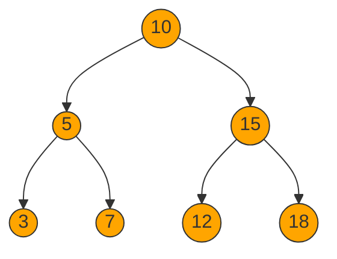
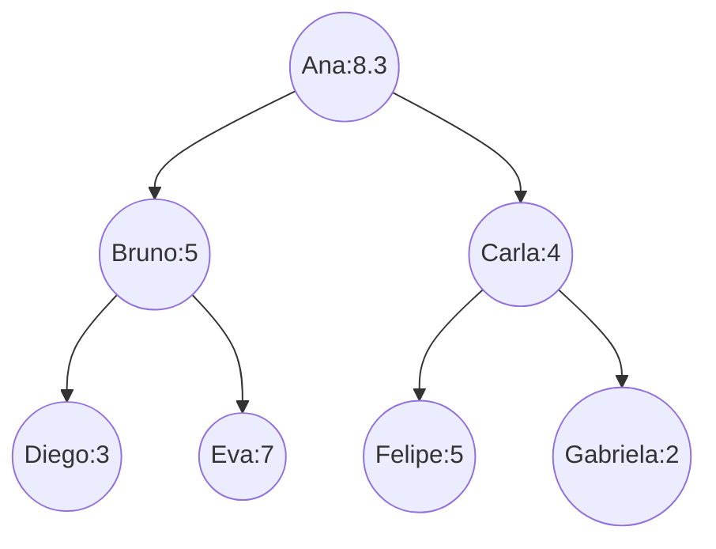

# 1. Árvores

## Sumário

- [1. Árvores](#1-árvores)
  - [Sumário](#sumário)
  - [1.1 Estrutura de Dados da Árvore](#11-estrutura-de-dados-da-árvore)
  - [1.2 Tipos de Árvores](#12-tipos-de-árvores)
  - [1.3 Operações em Árvores](#13-operações-em-árvores)
  - [1.4 Implementação de Árvores Binárias em C](#14-implementação-de-árvores-binárias-em-c)
    - [Criação da Estrutura da Árvore Binária](#criação-da-estrutura-da-árvore-binária)
    - [Exercício: Elementos a serem inseridos:](#exercício-elementos-a-serem-inseridos)
    - [Criando structs relevantes para o `dado`](#criando-structs-relevantes-para-o-dado)
  - [Próximos passos](#próximos-passos)

## 1.1 Estrutura de Dados da Árvore
Uma árvore é uma estrutura de dados hierárquica composta por nós (ou vértices) conectados por arestas. Cada nó pode ter zero ou mais filhos, e o nó no topo da hierarquia é chamado de raiz. Nós sem filhos são chamados de folhas.
Cada nó contém um valor ou dados, e a estrutura da árvore permite a organização eficiente e a busca de informações. As árvores são amplamente utilizadas em várias aplicações, como bancos de dados, sistemas de arquivos e algoritmos de busca.

## 1.2 Tipos de Árvores
Existem vários tipos de árvores, cada uma com suas características e usos específicos. Alguns dos tipos mais comuns incluem:
- **Árvore Binária**: Cada nó tem no máximo dois filhos, chamados de filho esquerdo e filho direito.
- **Árvore Binária de Busca (BST)**: Uma árvore binária onde o valor do nó esquerdo é menor que o valor do nó pai, e o valor do nó direito é maior.
- **Árvore AVL**: Uma árvore binária de busca auto-balanceada, onde a diferença de altura entre as subárvores esquerda e direita de qualquer nó é no máximo 1.
- **Árvore B**: Uma árvore balanceada usada em sistemas de banco de dados e sistemas de arquivos, onde cada nó pode ter mais de dois filhos.
- **Árvore Trie**: Uma árvore usada para armazenar um conjunto dinâmico de strings, onde cada nó representa um caractere.

## 1.3 Operações em Árvores
As operações comuns realizadas em árvores incluem:
- **Inserção**: Adicionar um novo nó à árvore.
- **Remoção**: Remover um nó existente da árvore.
- **Busca**: Encontrar um nó com um valor específico.
- **Percurso**: Percorrer todos os nós da árvore em uma ordem específica (pré-ordem, em-ordem, pós-ordem, nível).

## 1.4 Implementação de Árvores Binárias em C
A implementação de árvores pode ser feita usando estruturas de dados como listas encadeadas ou arrays. A escolha da implementação depende do tipo de árvore e das operações que serão realizadas com mais frequência. A seguir, um exemplo simples de implementação de uma árvore binária em C:

A seguir iremos implementar uma árvore e suas principais funções em C.

### Criação da Estrutura da Árvore Binária

```c
#include <stdio.h>
#include <stdlib.h>
#include <stdbool.h>

// Definição da estrutura do nó da árvore
typedef struct Node {
    int data;
    struct Node* esq;
    struct Node* dir;
} Node;

// Função para criar um novo nó
Node* createNode(int data) {
    Node* novo = (Node*)malloc(sizeof(Node));
    novo->data = data;
    novo->esq = NULL;
    novo->right = NULL;
    return novo;
}
```

Função main para testar a criação de um nó:

```c
int main() {
    Node* raiz = createNode(10);
    printf("Raiz: %d\n", raiz->data);
    return 0;
}
```
### Exercício: Elementos a serem inseridos:

Exercício: Insira mais nós na árvore e imprima seus valores para verificar a estrutura da árvore, navegue na estrutura da árvore para acessar os filhos esquerdo e direito do nó raiz.

<div align="center">



</div>

### Criando structs relevantes para o `dado`

Os dados apresentados na árvore podem ser de qualquer tipo, mas para este exemplo, usaremos inteiros. Se você quiser armazenar outros tipos de dados, como strings ou estruturas mais complexas, você pode modificar a estrutura do nó para incluir esses tipos.

```c
typedef struct Node {
    int data; // Pode ser modificado para outros tipos, como char*, float, etc.
    struct Node* esq;
    struct Node* dir;
} Node;
``` 

Também podemos criar uma struct para armazenar dados mais complexos:

```c
typedef struct Aluno {
    int id;
    char nome[50];
    float valor;
} Aluno;

typedef struct Node {
    Aluno dado; // Agora o nó armazena uma struct Aluno
    struct Node* esq;
    struct Node* dir;
} Node;
```
Desse forma, cada nó da árvore pode armazenar um conjunto de informações mais complexo. 

Um exemplo de criação de um nó com a `struct Aluno`:

```c
Aluno criarAluno(int id, const char* nome, float valor) {
    Aluno aluno;
    aluno.id = id;
    strncpy(aluno.nome, nome, sizeof(aluno.nome) - 1);
    aluno.nome[sizeof(aluno.nome) - 1] = '\0'; 
    aluno.valor = valor;
    return aluno;
}
//Obs.: É necessário incluir a biblioteca string.h para usar a função strncpy
```

Feito isso, você pode criar nós da árvore que armazenam informações de alunos:

```c
Node* createNode(Aluno dado) {
    Node* novo = (Node*)malloc(sizeof(Node));
    novo->dado = dado;
    novo->esq = NULL;
    novo->dir = NULL;
    return novo;
}
```
Observe que o No agora armazena uma struct `Aluno` em vez de um simples inteiro.

Observe como pode ficar a função main com a struct `Aluno`:

```c
int main() {
    Aluno aluno1 = criarAluno(1, "Joao", 9.5);
    Node* raiz = createNode(aluno1);
    printf("Raiz: %s, ID: %d, Valor: %.2f\n", raiz->dado.nome, raiz->dado.id, raiz->dado.valor);
    return 0;
}
```

Exercício: Modifique a função main para criar mais nós com diferentes alunos e conectá-los na árvore. Crie uma árvore de alunos como a apresentada no diagrama abaixo:
<div align="center">



</div>

## Próximos passos

Iremos implementar as funções abaixo:

1. Inserção de nós na árvore
2. Percurso em-ordem (in-order traversal)
3. Busca de um valor na árvore
4. Remoção de um nó da árvore
5. Altura da árvore
6. Antecessor e sucessor de um nó
